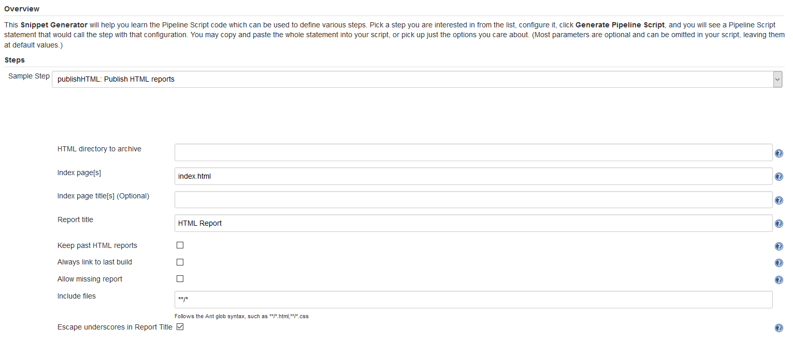

Older versions of this plugin may not be safe to use. Please review the
following warnings before using an older version:

-   [Path traversal vulnerability allows arbitrary file
    writing](https://jenkins.io/security/advisory/2018-04-16/#SECURITY-784)
-   [Stored XSS
    vulnerability](https://jenkins.io/security/advisory/2019-10-01/#SECURITY-1590)

  

This plugin publishes HTML reports.

Starting in versions 1.625.3 and 1.641, Jenkins restricted what kind of
content could be displayed when serving static files. This can impact
how HTML files archived using this plugin are displayed. See
[Configuring Content Security
Policy](https://wiki.jenkins.io/display/JENKINS/Configuring+Content+Security+Policy)
for more information.

### Installation Steps:

1. Go to Jenkins Dashboard  
2. Click on the link that says "Manage Jenkins"  
3. On the Plugin Manager page, go to the "Available" tab next to Updates
tab  
4. Look for the html publisher plugin, select the checkbox and click
install. Wait for it come back with status "Success".  
5. Restart Jenkins by clicking the provided link on the success page, or
if using tomcat, executing \<tomcat-Jenkins\>/bin/shutdown.sh and
\<tomcat-Jenkins\>/bin/startup.sh

### How to use HTML Publisher Plugin with Pipeline

You can use the **publishHTML** step to publish the report in your pipeline.

Use the pipeline-syntax URL and generate the syntax at <JENKINS-URL>/pipeline-syntax/




A possible snippet might look like:

```groovy
  publishHTML (target: [
      allowMissing: false,
      alwaysLinkToLastBuild: false,
      keepAll: true,
      reportDir: 'coverage',
      reportFiles: 'index.html',
      reportName: "RCov Report"
    ])
```


### How to use HTML Publisher Plugin:

HtmlPublisher plugin is useful to publish the html reports that your
build generates to the job and build pages. Below are the steps to
publish and archive the HTML report files:

1. Click on the Configure option for your Jenkins job.

2. In the post build portion, look for the Publish HTML Reports option
and select the checkbox. See the screen shot below

    Fill the path to the directory containing the html reports in the "HTML
directory to archive" field. Specify the pages to display (default
index.html); you can specify multiple comma-separated pages and each
will be a tab on the report page. You can also specify titles for the
report page that appears on the tab, by default, file name will be taken
as title.  Finally, give a name in the Report Title field, which will be
used to provide a link to the report. By default, only the most recent
HTML report will be saved, but if you'd like to be able to view HTML
reports for each past build, select "Keep past HTML reports."

    

    Some time at HTML directory, you don't have to specify project name, but
have to start one level below. For e.g. if your project name is "ABC"
and if HTML files are at "ABC/report-output/html" then you have to
specify just **\\test-output\\html\\.**

3. After saving the configuration, run build once. The published HTML
reports are available to view from within Jenkins with convenient links
in the dashboard.

### Changelog

